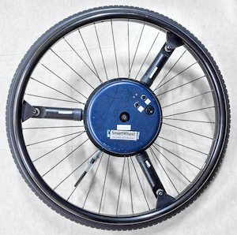

# kineticstoolkit_pushrimkinetics

**Obsolete**. In date of June 20th 2025, all extensions are migrated to the new `kineticstoolkit_extensions` package, which can be installed using pip or conda. The new extension mechanism, which has been selected to maximize the stability of the code in time (for example by running unit tests continuously) is explained [here](https://kineticstoolkit.uqam.ca/doc/extensions.html).

To use the `pushrimkinetics` extension, we now install both `kineticstoolkit` and `kineticstoolkit_extensions`, and then all `pushrimkinetics` functions become available in the `kineticstoolkit.ext.pushrimkinetics` namespace.

This repository will be archived or deleted in the future.

Old description below.

---

Provide functions to process kinetic data from instrumented wheelchair wheels
such as the SmartWheel, pictured below.

The functions provided by this module are:

- `read_smartwheel(filename)`: Read a file generated by the SmartWheel instrumented wheel.
- `apply_calibration(ts, gains, offsets, *, transducer, reference_frame)`: Calculate pushrim forces and moments based on raw channel values.
- `remove_offsets(ts, baseline_kinetics)`: Remove dynamic offsets in forces and moments.
- `calculate_velocity(ts)`: Calculate velocity based on wheel angle.
- `calculate_power(ts)`: Calculate power based on wheel velocity and moment.

## How to use this module

1. Copy [`kineticstoolkit_pushrimkinetics.py`](kineticstoolkit_pushrimkinetics.py) in your working directory;
2. Import it, for example using `import kineticstoolkit_pushrimkinetics as pk`.

Please refer to [this tutorial](tutorial.ipynb) to see the extension in action.

## Note on Kinetics Toolkit extensions

This module was formely a Kinetics Toolkit extension. As of June 2025, it has
been converted to a simpler module that you simply download and add to your
Python path or working directory. KTK extensions are being progressively phased
out toward this much simpler method.
